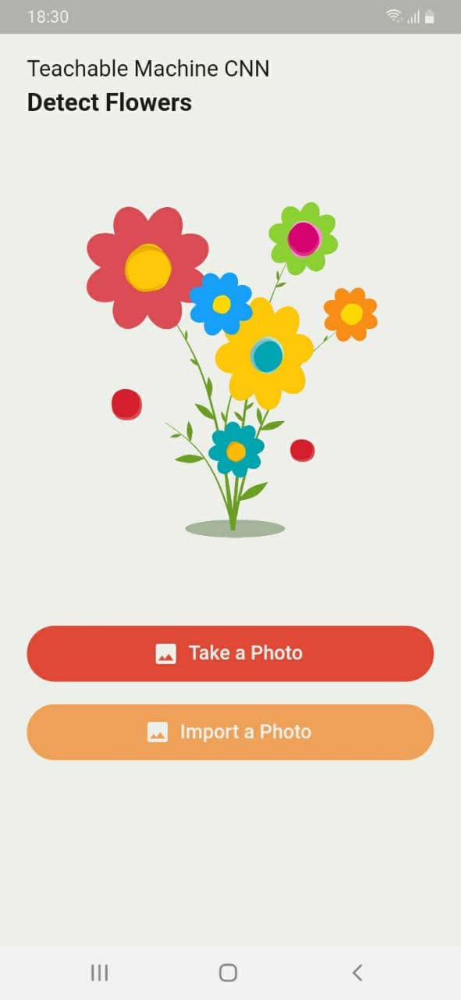
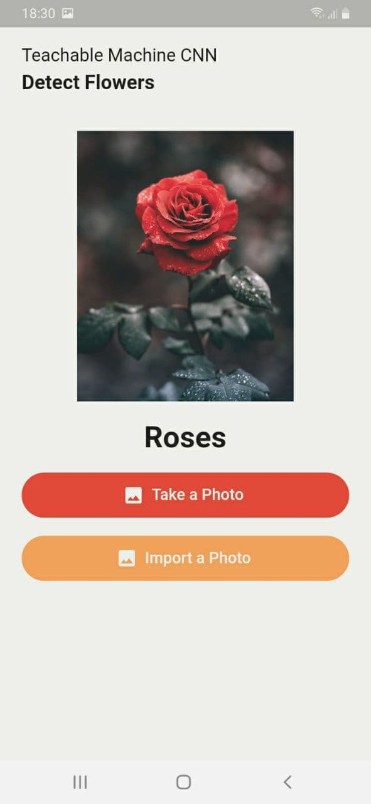
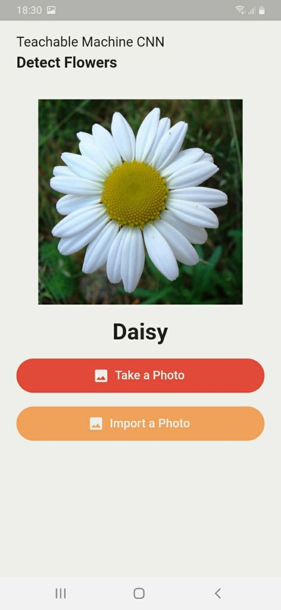
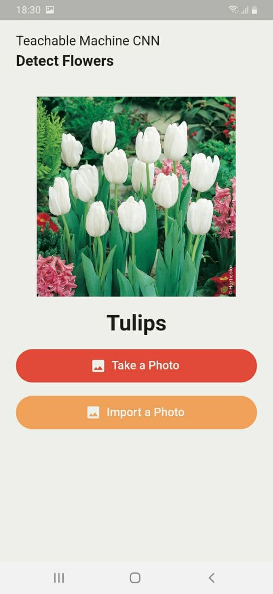

# Flower-Prediction

## Description:

Flower Predictiona Flutter Application that predict the type of a flower, I used tensorflowLite to use my trained model.

## ScreenShots:

   

## Tools & languages:
* Android studio (IDE)
* Dart (logic)
* Flutter (Mobile UI developement kit)
* Paint.net (Image editor)
* Google colab (web IDE)

## Contribution:
Feel free to fork this project and add whatever you like. If you have any suggestions or any comments please feel free to contact me or to open an issue.

## Team:
[Jetlighters](https://github.com/JetLightStudio) having fun.

## Documentation
* [Install Flutter](https://flutter.dev/get-started/)
* [Flutter documentation](https://flutter.dev/docs)

For announcements about new releases and breaking changes, follow the
[flutter-announce@googlegroups.com](https://groups.google.com/forum/#!forum/flutter-announce)
mailing list.
